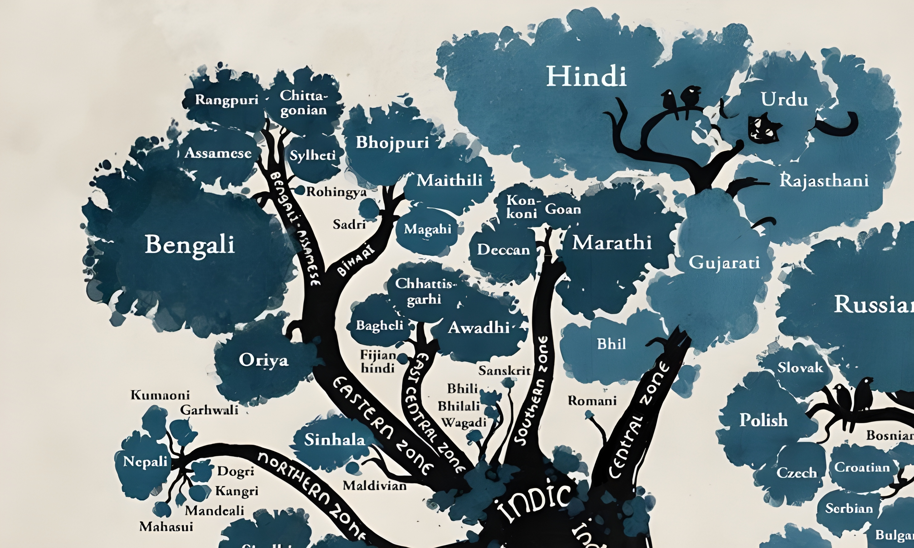



Do you know? According to Indian Census 2011,
===

|                                                    **Languages**                                                     | **Speakers (in Million)** |
|:--------------------------------------------------------------------------------------------------------------------:|:-------------------------:|
|                  **Assamese (অসমীয়া)**  Indo-Aryan, Assamese script, widely spoken in Assam.                   |            24             |
|     **Bangla (বাংলা)**  Indo-Aryan, Bengali script, widely spoken in West Bengal, Tripura, and Bangladesh      | 107 (India), 300 (Total)  |
|                  **Bodo**  Sino-Tibetan, Devanagari script, widely spoken in Assam and Nepal                   |            1.4            |
|           **Dogri (डोगरी)**  Indo-Aryan, Devanagari script, widely spoken in Jammu, Northern Punjab            |            1.6            |
|               **Hindi (हिंदी)**  Indo-Aryan, Devanagari script, widely spoken in Northern India                |            692            |
|                   **Konkani (कोंकणी)**  Indo-Aryan, Devanagari script, widely spoken in Goa                    |             2             |
|            **Maithili (मैथिली)**  Indo-Aryan, Devanagari script, widely spoken in Bihar, Jharkhand             |            14             |
|                   **Odia (ଓଡିଆ)**  Indo-Aryan, Odia script, widely spoken in Odisha (Orissa)                   |            43             |
| **Sanskrit (संस्कृत)**  Indo-Aryan Classical, Devanagari script, widely spoken in Himachal Pradesh, Uttarkhand |           0.025           |

## Will be covering more, support us in our journey 🙏
### We want to preserve the linguistic diversity of India and every other parts of the world even in the age of massive globalization.

